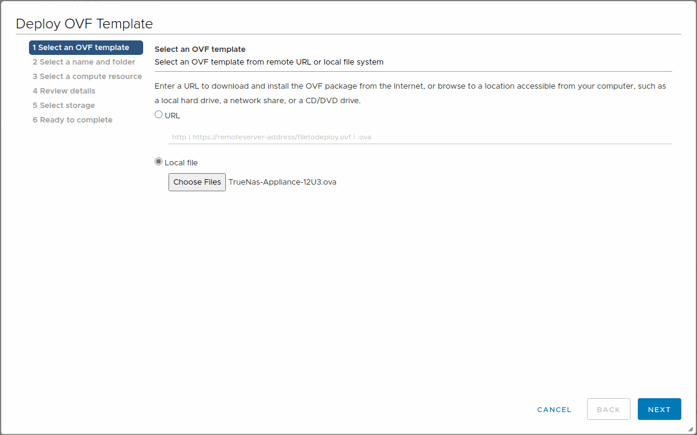
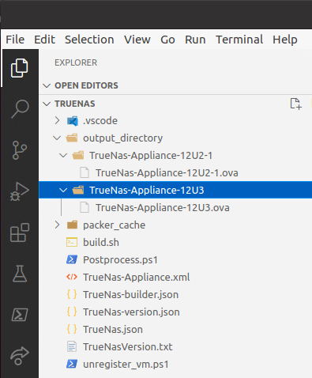

# TrueNas-Appliance Virtual Appliance (OVA) with Packer

The TrueNas-Appliance can be deploy with three size :

* **Small:**     1vCPU and 4 GB RAM
* **Medium:**    4vCPU and 8 GB RAM
* **Large:**     4vCPU and 16 GB RAM



The **appliance** have one disk (20GB) for the system and eight disks (60GB/Disks) for your `Share` or `LUN` **iSCSI**.
## Requirements

* Linux Desktop in my case I use an Ubuntu 20.04
* vCenter Server 
* [VMware OVFTool 4.4.1 (x86)](https://my.vmware.com/group/vmware/downloads/details?downloadGroup=OVFTOOL441&productId=974)
* [Packer 1.6.4+ (x86)](https://www.packer.io/intro/getting-started/install.html)


## Step 1 - Clone the git repository

```bash
git clone https://github.com/JM2K69/TrueNas-Appliance.git
```
Or

```bash
git clone https://github.com/PowerTrueNas/TrueNas-Appliance.git
```


## Step 2 - Edit the `TrueNas-version.json` file to configure the TrueNas Version and configuration vSphere endpoint for building the PhotonOS appliance

```json
{
  "version": "0.1.3",
  "description": "TrueNas Appliance-12U3",
  "vm_name": "TrueNas-Appliance-12U3",
  "iso_checksum": "de5c9a6bbdd1f77bca7eac8b22974394ec3ccf26477a9d465dda40bb5809c0a0",
  "iso_url": "https://download.freenas.org/12.0/STABLE/U3/x64/TrueNAS-12.0-U3.iso",
  "numvcpus": "4",
  "ramsize": "8192",
  "guest_username": "root",
  "guest_password": "freenas"
}
```

**Note:** If you want to choose an other **TrueNas** version you can pickup version in the file `TrueNasVersion.txt` you can find the 
* **Description**
* **URL**
* **SHA256**

```TXT
Description;URL;SHA256
TrueNas-12U3;https://download.freenas.org/12.0/STABLE/U3/x64/TrueNAS-12.0-U3.iso;de5c9a6bbdd1f77bca7eac8b22974394ec3ccf26477a9d465dda40bb5809c0a0
TrueNas-12U2-1;https://download.freenas.org/12.0/STABLE/U2.1/x64/TrueNAS-12.0-U2.1.iso;cfc48d9b2a333b2ae6b6341ed407adf697ff674d40e24343ee01470fb479bb67
TrueNas-12U2;https://download.freenas.org/12.0/STABLE/U2/x64/TrueNAS-12.0-U2.iso;2592eb9d24f22edf5607af4506a2fe28462f061000ee635f8dc2a81394530093
TrueNaS-12U1-1;https://download.freenas.org/12.0/STABLE/U1.1/x64/TrueNAS-12.0-U1.1.iso;b717a9453d86b8ed939255fac93755d76180181345445702368486c0f9fb5283
TrueNas-12U1;https://download.freenas.org/12.0/STABLE/U1/x64/TrueNAS-12.0-U1.iso;cdb9d95b7f6154e58978fcbb1a1749b80af58c999a8dfd20d32ccf3c2fbb9d4a
TrueNaS-12GA;https://download.freenas.org/12.0/STABLE/RELEASE/x64/TrueNAS-12.0-RELEASE.iso;68c9a49d8072afc58475c9a2ece2b04beac0cabe40d970fa96da1c0833aa1935
```

## Step 3 - Edit the `TrueNas.json` file to configure the vSphere endpoint for building the TrueNas-Appliance

You need to edit also the `variable` section.

```json
{
  "variables": {
    "ovftool_deploy_vcenter": "VCSA FQDN",
    "ovftool_deploy_esxi":"FQDN ESXI",
    "ovftool_deploy_vcenter_username": "administrator@vsphere.local",
    "ovftool_deploy_vcenter_password": "YourP@$$w0rdv€rySecret!",
    "builder_host_datastore": "YourDataStore",
    "builder_host_portgroup": "Your PortGroup"
  },
.....
}
```
**Note:** If you need to change the initial root password on the TrueNas-Appliance, take a look at `TrueNas-version.json` 

## Step 4 - Start the build by running the build script which simply calls Packer and the respective build files

```
./build.sh
````
When the Build is done you can find in your folder **./output_directory/** a new directory with the **OVA** Appliance.



And now you can play with your TrueNas Appliance for your VMware Home Lab or for your Student ;) ! ! 

